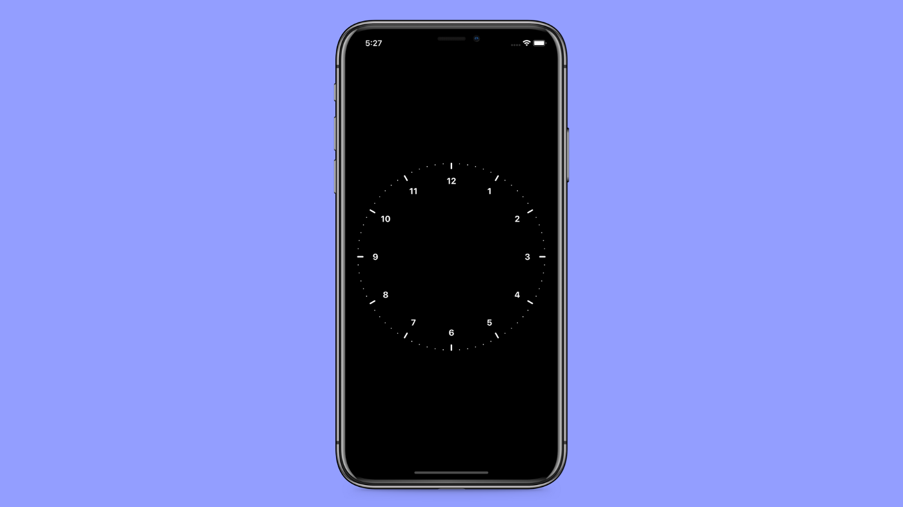
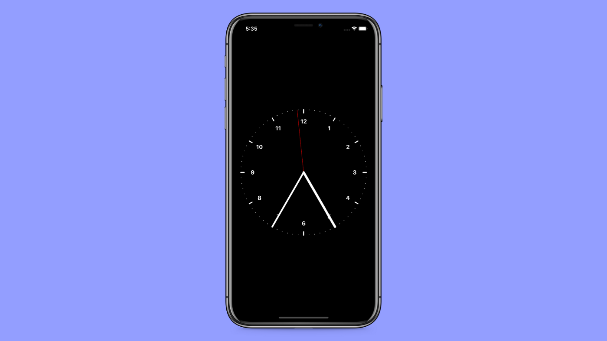
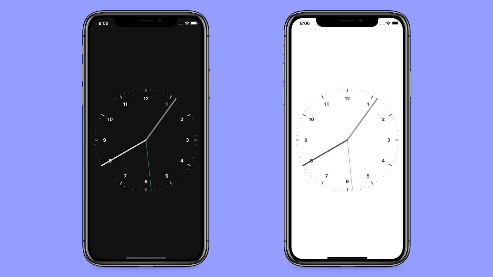

In this article, we are going to look at how to draw a nice-looking analog clock face by using react-native, react-native-svg , and styled-components. The clock is going to tell time, tick, and have support for dark and light themes.
This is based on the work I’ve done on Nyxo, where we should a clock face as the base for showing your sleep data. I’ve been getting some questions on how to create something similar, which is why I wrote this guide to create them yourselves. If you just want to get your hands on the code, [it’s here.](https://github.com/plahteenlahti/HelloClock)


## Getting started

Let's start by initing a new project. You could very well do this with Expo, but I prefer to use the ejected version of so React Native, so we are going to use the `react-native-cli` and the TypeScript example project to get started:

```bash
npx react-native init helloClock  --template react-native-template-typescript
```

after that, let's install the only external library, we need: `react-native-svg.`

```bash
npm install react-native-svg
```

Then we need to navigate to `ios` folder and install required pods:

```bash
cd ios & pod install cd -
```

You can now run the project:

```bash
$ react-native run-ios
```

## Folder structure

I'm going to structure the project in the following way:

```
HelloClock
├── index.js
├── App.tsx
├── components
│	├── Hand.tsx
│	├── ClockMarkings.tsx
│	└── Clock.tsx
├── helpers
│	├── geometry.ts
│	├── time.ts
│	└── useInterval.ts
```

## Polar and Cartesian Coordinates

Now to the bread and butter of this article so how to convert time to coordinates on SVG.

We can think of clock times in degrees, i.e., 12 am and 12 pm clock being the same as 0° and 6 pm and 6 am being 180°. We could, of course, use radians as well, but for me, at least degrees feel more familiar. A coordinate system which uses angle and reference point to determine a point on a plane is [Polar coordinate system](https://en.wikipedia.org/wiki/Polar_coordinate_system).

Converting time to Polar coordinate systems is relatively simple. Let's say we, for example, want to determine the angle of the minute hand on a clock in degrees when we know the number of minutes to be 30. If one full revolution is 60 minutes and one complete revolution is 360°, then dividing 30 minutes with 60 and multiplying that with 360 gives the same number of minutes in degrees, which is 180. Let's implement that with code into the time file:

```typescript
export function polarToCartesian(
  centerX: number,
  centerY: number,
  radius: number,
  angleInDegrees: number
) {
  const angleInRadians = ((angleInDegrees - 90) * Math.PI) / 180.0;

  return {
    x: centerX + radius * Math.cos(angleInRadians),
    y: centerY + radius * Math.sin(angleInRadians),
  };
}
```

## Building the Clock Component

Let’s start the UI stuff by cleaning up the App.tsx file so that it only has a `StatusBar`, `SafeAreView` the `<Clock>`-component:

```typescript
// App.tsx
import React from "react";
import Clock from "./components/Clock";
import styled from "styled-components/native";

const App = () => {
  return (
    <>
      <StatusBar barStyle="light-content" />
      <SafeAreaView>
        <ScrollView
          centerContent={true}
          contentInsetAdjustmentBehavior="automatic"
        >
          <Clock />
        </ScrollView>
      </SafeAreaView>
    </>
  );
};

const ScrollView = styled.ScrollView`
  flex: 1;
  background-color: black;
`;

const SafeAreaView = styled.SafeAreaView`
  background-color: black;
  flex: 1;
`;

const StatusBar = styled.StatusBar.attrs(() => ({
  barStyle: "light-content",
}))``;

export default App;
```

Let’s not save the file just yet, but instead, start working on the Clock, ClockMarks, and Hand components. Import Dimensions from react-native and Svg-component from `react-native-svg` and make the Clock return a square SVG with the side of the squares being the same as the width of the mobile phone's screen by using the Dimensions helper:

```typescript
// Clock.tsx
import React from "react";
import Svg from "react-native-svg";
import { Dimensions } from "react-native";
const { width } = Dimensions.get("window");

const Clock = () => {
  return <Svg height={width} width={width}></Svg>;
};

export default Clock;
```

Now when we save, nothing should appear on the screen. This is because SVG itself has no visible parts. Let’s continue by adding the ClockMarks to communicate the minutes and hours. First, let’s define how many ticks we want. Let’s write those values above the Clock component:

```typescript
// Clock.tsx
import React from "react";
import Svg from "react-native-svg";
import { Dimensions } from "react-native";
const { width } = Dimensions.get("window");

const { width } = Dimensions.get("window");
const diameter = width - 40;
const center = width / 2;
const radius = diameter / 2;
const hourStickCount = 12;
const minuteStickCount = 12 * 6;

const Clock = () => {
  return <Svg height={width} width={width}></Svg>;
};

export default Clock;
```

We don’t want the clock to take the whole space of the screen, so we define the diameter to be the width of the screen minus 40. Then we want the clock to be in the center of the screen, so we divide the width of the screen with 2, and last we also need radius, which is, of course, half of the diameter.

For hours we want 12. In analog clocks, there are usually five divisions between every hour tick, and that’ How we are going to do it as well. However because because because we will keep the spacing between minute ticks consistent, it means that one of the minutes marking is going to overlap with every hour, we are going to add one extra tick and then multiply that by the number of hours, which equals to 72 minute markings

## Creating the Clock Divisions

Not let’s put the values to use by creating the clock face values. Create a new file ClockMarkings.tsx. The ClockMarkings.tsx is going to contain the clock divisions for both hours and minutes. The component is going to accept props for radius, center point, minutes, and hours. Radius and center are going to be used to determine the arc on which the divisions will be placed and hours and minutes are going to tell us how many tics we want.

```typescript
// ClockMarkings.tsx
import React from "react";
import { G, Line, Text } from "react-native-svg";
import { polarToCartesian } from "../helpers/geometry";

type Props = {
  radius: number;
  center: number;
  minutes: number;
  hours: number;
};

const ClockMarkings = (props: Props) => {
  const { radius, center, minutes, hours } = props;
  const minutesArray = new Array(minutes).fill(1);
  const hoursArray = new Array(hours).fill(1);

  const minuteSticks = minutesArray.map((minute, index) => {
    const start = polarToCartesian(center, center, radius, index * 5);
    const end = polarToCartesian(center, center, radius, index * 5);
    return (
      <Line
        stroke="white"
        strokeWidth={2}
        strokeLinecap="round"
        key={index}
        x1={start.x}
        x2={end.x}
        y1={start.y}
        y2={end.y}
      />
    );
  });

  const hourSticks = hoursArray.map((hour, index) => {
    const start = polarToCartesian(center, center, radius - 10, index * 30);
    const end = polarToCartesian(center, center, radius, index * 30);
    const time = polarToCartesian(center, center, radius - 35, index * 30);

    return (
      <G key={index}>
        <Line
          stroke="white"
          strokeWidth={3}
          strokeLinecap="round"
          x1={start.x}
          x2={end.x}
          y1={start.y}
          y2={end.y}
        />
        <Text
          textAnchor="middle"
          fontSize="17"
          fontWeight="bold"
          fill="white"
          alignmentBaseline="central"
          x={time.x}
          y={time.y}
        >
          {index === 0 ? 12 : index}
        </Text>
      </G>
    );
  });

  return (
    <G>
      {minuteSticks}
      {hourSticks}
    </G>
  );
};

export default ClockMarkings;
```

We use the hours and minutes variables to create arrays that match in length to the division count we want. Then we map those arrays to return Svg lines and make use of the polarToCartesian function we created earlier to the get correct position of the tics on the arc. I also added the Text tag so we can have nice numbers on the clockface. Because the array starts from zero, instead of using the index to render the number, in that case, it switches it with 12, so that our clock has number 12 on the top instead of zero.

Now if we add the ClockMarkings component to the Clock component and pass the variables for the clock face from earlier, we get something that looks something like this:



## Creating the Clock Hands

The clock is nothing without the hands so let’s make those next. Create a new component called Hand.tsx in the components folder with the following code:

```typescript
// Hand.tsx
import React from "react";
import { Line } from "react-native-svg";
import { polarToCartesian } from "../helpers/geometry";

type Props = {
  center: number;
  radius: number;
  angle: number;
  strokeWidth: string;
  stroke: string;
};

const Hand = (props: Props) => {
  const { center, radius, angle, stroke, strokeWidth } = props;
  const { x, y } = polarToCartesian(center, center, radius, angle);

  return (
    <Line
      x1={center}
      y1={center}
      x2={x}
      y2={y}
      strokeWidth={strokeWidth}
      strokeLinecap="round"
      stroke={stroke}
    />
  );
};

export default Hand;
```

This component is a lot simpler than the Clock markings because it’s only a single SVG line. We use the function polarToCartesia from earlier and pass down the angle from Clock.tsx to this component, as well as the strokeWidth and stroke variables which we going to use to make the hands for seconds, minutes, and hours to differ from each other.

```typescript
import React, { useState } from "react";
import Svg from "react-native-svg";
import { Dimensions } from "react-native";
import ClockMarkings from "./ClockMarkings";
import Hand from "./Hand";
import { useInterval } from "../helpers/hooks";
import { getTime } from "../helpers/time";

const { width } = Dimensions.get("window");
const diameter = width - 40;
const center = width / 2;
const radius = diameter / 2;
const hourStickCount = 12;
const minuteStickCount = 12 * 6;

const Clock = () => {
  let [time, setTime] = useState(getTime);

  useInterval(() => {
    setTime(getTime);
  }, 1000);

  return (
    <Svg height={width} width={width}>
      <ClockMarkings
        minutes={minuteStickCount}
        hours={hourStickCount}
        radius={radius}
        center={center}
      />
      <Hand
        angle={time.seconds}
        center={center}
        radius={radius}
        stroke="red"
        strokeWidth="1"
      />
      <Hand
        angle={time.minutes}
        center={center}
        radius={radius}
        stroke="white"
        strokeWidth="5"
      />
      <Hand
        angle={time.hours}
        center={center}
        radius={radius}
        stroke="white"
        strokeWidth="7"
      />
    </Svg>
  );
};

export default Clock;
```

You could now use this component to make a clock look like something in the picture below. However, because our clock hands don’t accept time yet, you would need to calculate the correct angle for the time you want to display. So let’s continue by creating a couple of helper functions that will allow us to turn time values into coordinates for our clock.



```typescript
// time.ts
export const to12hClock = (hour: number): number => {
  return hour > 12 ? hour - 12 : hour;
};

type TimeObject = {
  hours: number;
  minutes: number;
  seconds: number;
};

export const getTime = (): TimeObject => {
  const date = new Date();
  const hours = (to12hClock(date.getHours()) / 12) * 360;
  const minutes = (date.getMinutes() / 60) * 360;
  const seconds = (date.getSeconds() / 60) * 360;
  return { hours, minutes, seconds };
};
```

Let’s go over what the functions do. The to12hClock function is just a small helper to convert 24 -hour clock to 12-clock when getting the hours with the getHours function of JavaScript Date. The getTime function is also quite straight forward. Each time the function is called it creates a new Date object and then uses the native time functions and simple mathematics to convert those to degrees.

Let’s also create a new useInterval hook, that we can then use to periodically create new time for our clock. Here’s the code for it:

```typescript
// useInterval.ts
import React, { useState, useEffect, useRef } from "react";

// From Dan Abramov https://overreacted.io/making-setinterval-declarative-with-react-hooks/
export function useInterval(callback, delay) {
  const savedCallback = useRef();

  // Remember the latest callback.
  useEffect(() => {
    savedCallback.current = callback;
  }, [callback]);

  // Set up the interval.
  useEffect(() => {
    function tick() {
      savedCallback.current();
    }
    if (delay !== null) {
      let id = setInterval(tick, delay);
      return () => clearInterval(id);
    }
  }, [delay]);
}
```

Modify the clock component to use our new getTime function with the useInterval and useState hooks and we ourselves a clock that ticks!

```typescript
// Clock.tsx

import React, { useState } from "react";
import Svg from "react-native-svg";
import { Dimensions } from "react-native";
import ClockMarkings from "./ClockMarkings";
import Hand from "./Hand";
import { useInterval } from "../helpers/hooks";
import { getTime } from "../helpers/time";

const { width } = Dimensions.get("window");
const diameter = width - 40;
const center = width / 2;
const radius = diameter / 2;
const hourStickCount = 12;
const minuteStickCount = 12 * 6;

const Clock = () => {
  let [time, setTime] = useState(getTime);

  useInterval(() => {
    setTime(getTime);
  }, 1000);

  return (
    <Svg height={width} width={width}>
      <ClockMarkings
        minutes={minuteStickCount}
        hours={hourStickCount}
        radius={radius}
        center={center}
      />
      <Hand
        angle={time.seconds}
        center={center}
        radius={radius}
        stroke="red"
        strokeWidth="1"
      />
      <Hand
        angle={time.minutes}
        center={center}
        radius={radius}
        stroke="white"
        strokeWidth="5"
      />
      <Hand
        angle={time.hours}
        center={center}
        radius={radius}
        stroke="white"
        strokeWidth="7"
      />
    </Svg>
  );
};

export default Clock;
```

## Theming the Clock

Supporting a dark mode is almost a must these days. So let’s stylize our clock a little and add a dark mode.

Let’s start by creating a themes.ts file in the root of the project and with the following contents:

```typescript
themes.ts;

import { DefaultTheme } from "styled-components/native";

declare module "styled-components" {
  export interface DefaultTheme {
    style: string;
    bgColor: string;
    primaryColor: string;
    secondaryColor: string;
    accentColor: string;
  }
}

export const lightTheme: DefaultTheme = {
  style: "light",
  bgColor: "white",
  primaryColor: "#333",
  secondaryColor: "#555",
  accentColor: "#4a5aef",
};

export const darkTheme: DefaultTheme = {
  style: "dark",
  bgColor: "#111",
  primaryColor: "#fff",
  secondaryColor: "#CACACA",
  accentColor: "#4aefd5",
};
```

I’m going to use four colors in this case. To get TypeScript support, I made a custom theme declaration. If you want to learn more about that, [I have written about it earlier here](https://www.lahteenlahti.com/styled-components-theming-with-typescript/).

Then we need to convert some of our existing components to use those theme variables instead of the previously set colors. This is what it should look like in the App.tsx

```typescript
// App.tsx
//...ealier App.tsx code

const ScrollView = styled.ScrollView`
  flex: 1;
  background-color: ${({ theme }) => theme.bgColor};
`;

const SafeAreaView = styled.SafeAreaView`
  background-color: ${({ theme }) => theme.bgColor};
  flex: 1;
`;

const StatusBar = styled.StatusBar.attrs(({ theme }) => ({
  barStyle: theme.style === "dark" ? "light-content" : "dark-content",
}))``;
```

Let’s also change the styling of the clock markings and the clock hands so that with the dark theme we change the stroke and fill colors in the following way:

```typescript
// ClockMarkings.ts

const Minute = styled(Line).attrs(({ theme }) => ({
  stroke: theme.secondaryColor,
}))``;

const HourLine = styled(Line).attrs(({ theme }) => ({
  stroke: theme.secondaryColor,
}))``;

const HourNumber = styled(Text).attrs(({ theme }) => ({
  fill: theme.primaryColor,
}))``;

// Clock.ts

const Seconds = styled(Hand).attrs(({ theme }) => ({
  stroke: theme.accentColor,
  strokeOpacity: "1",
}))``;

const Minutes = styled(Hand).attrs(({ theme }) => ({
  stroke: theme.primaryColor,
  strokeOpacity: "0.5",
}))``;

const Hours = styled(Hand).attrs(({ theme }) => ({
  stroke: theme.primaryColor,
  strokeOpacity: "0.8",
}))``;
```

You will need to change the props on the Hand component so that the stroke and strokeOpacity are passed down to the underlying SVG component. You can find the full code on how that is done here.

## End Result

Now you should have a ticking clock that respects the user’s preferred theme. If you wanted to improve this, you could animate the hand movements.


