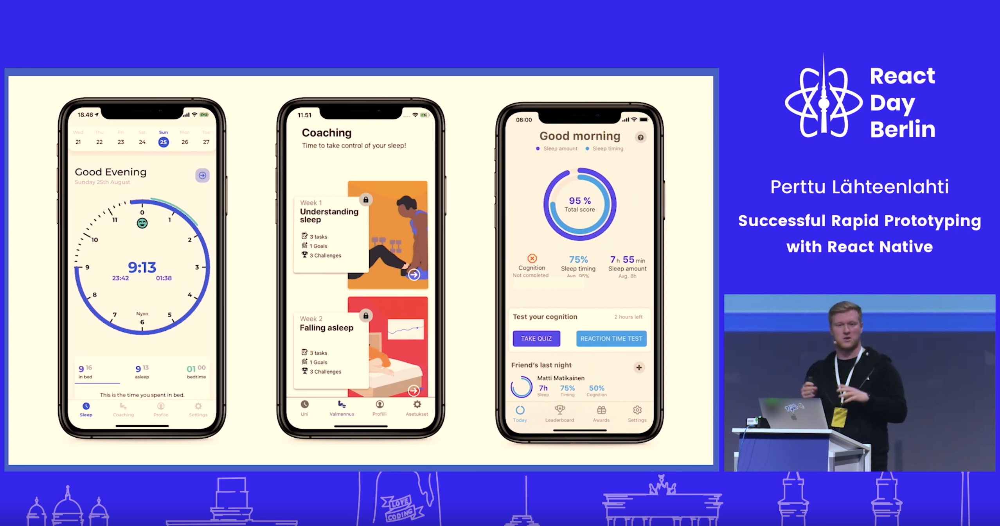
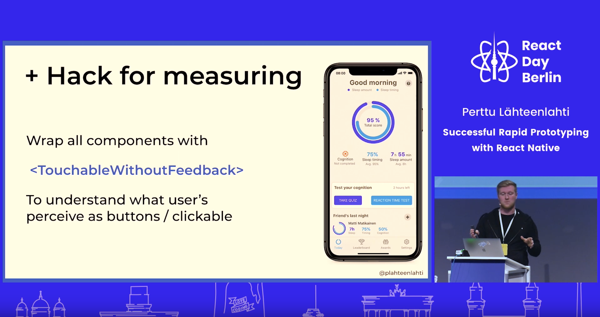

`embed: https://www.youtube.com/embed/QafikEOSUGA`

This is a transcript of a lightning talk I gave at React Day Berlin in 2019. You can watch the talk [here](), and download the presentation slides [here](). All the links resources are available at the end of this transcript.

We're gonna talk about successful rapid prototyping, what that exactly is, and what it means in practice. We're going to go through why you should prototype, what are the
reasons for doing that how do you succeed in that and why in order to succeed you should do that prototyping with react native. After that once you've kind of figured out that React Native is kind of the thing that you use we're gonna look at what tools use with it.

But before we go in to all that I want to give a little introduction to myself. So the reason for my really difficult name better to plat and lofty is because I'm from Finland,which is by the way celebrating its independence day today. I'm a developer slash designer at a company called Nyxo where we build personalized sleep coaching programs in a mobile app format.

The reason why I know a lot about prototypes is because I've taken part in around 70 hackathons. I've won about 40 of those, so I've been also successful in these basically competitions of building prototypes. But let's get to the subject at hand so why prototype? Reasons with that are pretty simple: you're starting from scratch
, want to maybe try a new technology, or you just don't know what is gonna happen next you might not have no idea what you're gonna do whether you're in a building for example a client project and then in total the path is not that clear on what you're trying to achieve and what direction you're trying to code through Wars

That's exactly where I started about a year ago when I was hired by two university research to commercialize their sleep research. I went to the first meeting and the conversation went a little like this:

**Researchers:** _"build us a product."_

**Me:** _"can you be more specific?"_

**Researchers:** _"build as a product that is nice to use and makes money."_

I was like that doesn't really make it any more clear. but then I decided that I might as well start by building a prototype. And actually I built these three prototypes. The one you see on the left we actually decided to experiment how people would like to see their sleep data and what what kind of presentation types work and what which do not. In the middle one we tested out how you should provide sleep coaching content, that means
exercises and lessons leave that is actually engaging and
interesting to use. And on the right one we actually tested that if you could make sleeping into a game so every night you would try to be sleep really well so you could compete against your friends who slept the best. really nice turned out

When I was researching the technology what should I build this with that I'm really bad at developing mobile stuff with iOS and Android and react native was kind of a perfect solution for that not just for precursor for prototyping but also like building the eventual end product. because it really easy to built it's really fast to build it's even faster deliver and it makes really easy to measure everything.

but let's look at why it's so faster built. You can find kind of use any basically UI component library react native paper is pretty good I've heard. I actually like to build them myself because it's easier the time books everything when you know that okay it will take me this much time to build that but you can get pretty fast and do some pretty cool stuff really fast with react native just because you have already existing kills from react and
JavaScript.

maybe even cooler is actually delivering fast and this actually saved our butts and when we were testing one of our pilot products with the largest life insurance company in the Finland. One Friday I got an email that hey this feature doesn't work for me and it was like we didn't never agreed on that feature so during the weekend I actually built it and released on Monday without real native I would have been able to do that because the usual way you do it through App Store connect and Play Store is really painful it takes a lot of days for Apple to look at but using we use Codepush we were able to boost the code to the users didn't notice that the feature was missing and actually on Monday I got an email sorry it might have be my device that it didn't work

Expo is a pretty good solution also offering you the same capabilities of pushing code basically over-the-air. react native remote config that is part of react native firebase offers the
remote config it doesn't allow as much as codepush an Expo but you can still make changes on the app on the fly which is pretty cool.

My background is in actually in I used to pick carpenters for seven years and a lot of things we used to talk about that measure always twice once I transitioned the technology turned into measure
everything what the user is doing how long they are doing it and what they are doing so in prototyping see your programs is only as good as results and feedback you get you so you have to measure everything so in order to do that there's arts really good tools

amplify analytics one aw yes good firebase analytics basically Google and it is great as well and the App Center analytics that we used in our process was excellent in my opinion and there was actually a really nice hack that we used in order to kind of find this hidden information so we wrapped all the components that weren't supposed to be clickable or pressable with touchable fit without feedback and made them emit an analytics event to our back-end you see which parts of the app or UI users were pressing expecting them to do something so example here you can actually see there's a couple of things about your sleeve timing and stuff like that we had a lot of users pressing those others those who are supposed to be static which ended up that we realized that we have to build something that they can actually find more information about their sleep so that's a cool hack don't do it in production it actually it's really bad for accessibility but in prototyping it's fine.

This concludes my lightning talk on Successful rapid prototyping.

- Build fast with
  - [React Native Paper](https://reactnativepaper.com/)
- Deliver fast
  - [Expo](https://expo.io)
  - [CodePush](https://github.com/Microsoft/code-push)
  - [Remote Config](https://invertase.io/oss/react-native-firebase/v6/remote-config)
- Measure everything.
  - [AWS Amplify](https://aws-amplify.github.io/)
  - [App Center](https://appcenter.m)
  - [Firebase](https://rnfirebase.io/docs/v5.x.x/analytics/ios)
