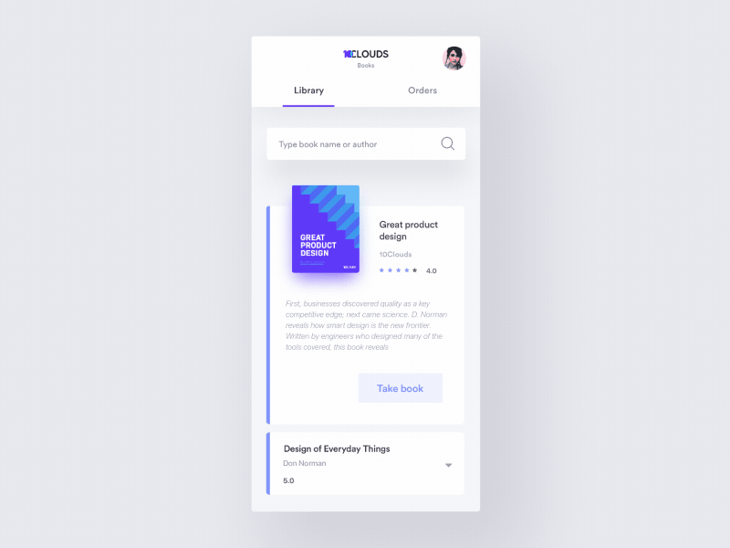

---

title: "Weekly 17/2018"
date: "2018-04-18"
---

#### Weekly collection of inspiration and articles for designers

**[44 Sites Where You Can Get Fabulous Free Photos](https://writingcooperative.com/44-sites-where-you-can-get-fabulous-free-photos-86838e545a2c)**

**[Why most people’s favorite color is blue](https://medium.com/@alexgabrielioana/why-most-peoples-favorite-color-is-blue-bd84fc4e4dfb)**

**[Good Designer, Bad Designer](http://bit.ly/lastLinkP)**

**[Inclusive Design is Not a Technology Problem](https://medium.com/mule-design/mule-newsletter-2-bc32cb9684e5)**

**[Version control for designers](https://plantapp.io/new-plugin)**

**[UI Interaction GIFs Of the Month — March 2018](https://medium.com/collect-ui-design-ui-ux-inspiration-blog/ui-interaction-gifs-of-the-month-march-2018-d0484226e43f)**

**[Designmodo Launches Massive Redesign and New Logo](https://medium.com/@designmodo/designmodo-launches-massive-redesign-and-new-logo-3e359ab3884)**

**[How to Create High-Quality GIFs](https://framer.com/blog/posts/how-to-create-high-quality-gifs)**

**[3 Underrated Fundamentals of UX](https://www.appcues.com/blog/ux-fundamentals)**

**[Brutalist design is the bad influence we all need](https://www.imaginarycloud.com/blog/why-we-need-web-brutalism/)**

by [Jakub Antalík](https://dribbble.com/antalik) for [Frame.io](https://dribbble.com/frameio)

by [Alex Sol](https://dribbble.com/alexsol)

by [Dannniel](https://dribbble.com/dannniel) for [Norde](https://dribbble.com/norde)

by [Aga Ciurysek](https://dribbble.com/agaciurysek) for [10Clouds](https://dribbble.com/10Clouds)

by [tubik](https://dribbble.com/Tubik)
