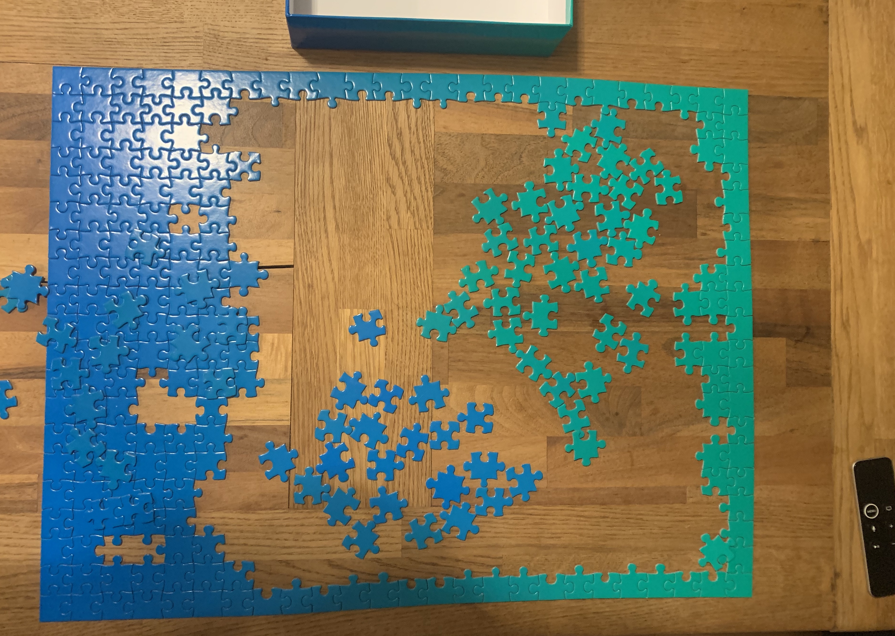

_**Weekly collection of links and resources I've come across this week. Also some updates about my life, the company I'm building and my investments as well.**_

---

### Tech

**[Universal Data Tool](https://github.com/UniversalDataTool/universal-data-tool)**  
Web/desktop app for editing and annotating images, text, audio, documents and to view and edit any data defined in the extensible the .udt.json and .udt.csv standard.

**[”Just walk out” technology by Amazon](https://justwalkout.com/)**  
Remember this [video](https://www.youtube.com/watch?v=NrmMk1Myrxc)? Now you get the same technology from Amazon. What do they get out of it? All your store's shopping data which make it easier to undercut your store in prices.

**[React Native 3D Animations Challenge](https://www.youtube.com/watch?v=mPzQRPjr-EI)**  
This is one sleek animation. William Candillon is just amazing.

**[React Image Comparison Slider](https://github.com/OnurErtugral/react-image-comparison-slider)**

**[React-table v7](https://github.com/tannerlinsley/react-table/releases/tag/v7.0.0)**  
I just posted a link to something created by Tanner Linsley, but now I'm posting another. If you haven't tried react-table you should. It uses hooks, and it is crazy customizable.

**[Block ads at home using Pi-hole and a Raspberry Pi](https://www.raspberrypi.org/blog/pi-hole-raspberry-pi/)**  
Last week I had a chat were the other person was complaining about the Youtube app on their Samsung TV always showing two ads before playing any video. If you want to get rid of those, take a look at Pi-hole.

---

### Design

Haven't really seen anything worth my time in the design sector and posting just random inspiration isn't really useful either. However I came across a cool new product that is not directly related to design:

**[OpenStanding – Custom-Branded Laptop Stands](https://openstanding.com/)**  
I've been following the creator after I came across his book [_Solving Product Design Exercises_](https://productdesigninterview.com/) (which is a good book btw). I like these stands. I would rather take one of these instead of socks of clothing. However I would most likely only take one.

Next week I will have more design links, I promise!

---

### Business, startups, founders and VCs

**YC W20 Demo Day is coming, here's all the startups that have launched on HN**
I've quickly gathered all the Y Combinator's winter 2020 batch startups that have launched on Hacker News. Here they are:

- [Cotter – simple logins with just phone numbers](https://www.cotter.app/)
- [Datree – security checks on commits](https://www.datree.io/),
- [PostHog – open source product analytics](https://posthog.com/)
- [Motion – defense against online distractions and addictions](https://www.inmotion.app/)
- [Orbiter – autonomous data monitoring for non-engineers](https://www.getorbiter.com/)
- [Flowdash – human-in-the-loop tooling for operations teams](https://flowdash.com/)
- [Syndetic – software for explaining datasets](https://www.getsyndetic.com/)
- [API Tracker – track and manage the APIs you use](https://www.apitracker.com)
- [Trustle – on-demand child development experts for parents](https://www.trustle.com)
- [Release – staging environments made easy](https://www.releaseapp.io)
- [Raycast – CLI-inspired desktop app for non-coding tasks](https://www.raycast.com)
- [Savvy – give employees tax-free cash for health insurance](https://www.gosavvy.com/)
- [Datasaur – data labeling interface for NLP](https://datasaur.ai/)
- [Deviceplane – update and manage devices running linux](https://deviceplane.com/)

---

### Other stuff

**Didn't work last weekend, got sick, now I'm solving puzzle**
This is just a funny observation (funny for me). Last weekend I deliberately decided not to do any work although I most likely should have. The weekend went find, but the following monday I fell sick, and had to cancel all my Tuesday meetings. Because of that I had a lot of time to work on something menial, I decided to try my hands at this gradient puzzle.

Putting the pieces together is pain.
